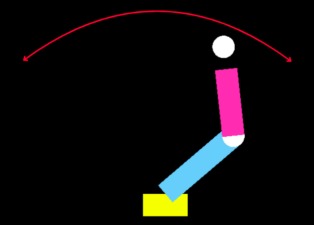

# 🦾 Braço Mecânico 2D com GLFW

<p align="center">
  
</p>

Este projeto implementa uma simulação simples de um braço mecânico em 2D utilizando a biblioteca GLFW para renderização OpenGL. O braço mecânico possui dois segmentos articulados que realizam movimentos oscilantes.

## Dependências

Antes de compilar e executar o código, é necessário instalar a biblioteca GLFW. No Linux, você pode instalar com:

```sh
sudo apt-get install libglfw3-dev
```

No macOS, utilize:

```sh
brew install glfw
```

## Compilação e Execução

Para compilar o código, utilize o seguinte comando:

```sh
g++ braco_mec.cpp -o braco_mec -lglfw -lGL -lm
```

E para executar:

```sh
./braco_mec
```

## Funcionamento

O programa cria uma janela com um braço mecânico composto por:
- Uma **base fixa** representada por um quadrado amarelo.
- Um **braço inferior** azul, que realiza rotação oscilante com base na função `sin()` do tempo.
- Um **braço superior** rosa, que também realiza rotação oscilante, mas com frequência diferente.
- **Articulações circulares** brancas nas junções entre os segmentos.

Os movimentos oscilantes dos segmentos criam um efeito de balanço do braço mecânico.

## Controles
Atualmente, o programa não possui controles interativos, mas pode ser modificado para responder a entradas do usuário, como teclas para ajustar o movimento dos braços.


