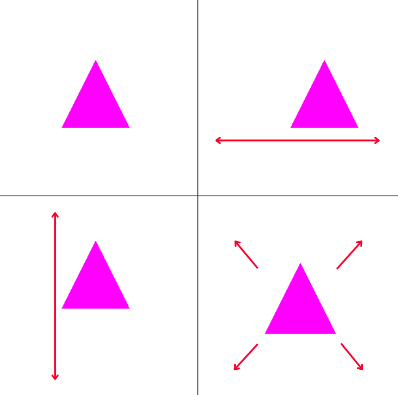

# 🔺 Projeção 2D com OpenGL

<p align="center">
  
</p>

## Descrição
Este projeto implementa transformações 2D utilizando OpenGL e GLUT. Ele exibe uma cena com quatro triângulos, cada um demonstrando diferentes transformações:
- **Triângulo fixo**
- **Triângulo em movimento horizontal**
- **Triângulo em movimento vertical**
- **Triângulo que aumenta e diminui de tamanho**

O objetivo é demonstrar conceitos de translação e escala em um sistema de coordenadas ortogonais.

## Funcionalidades
- Exibição de eixos cartesianos para referência.
- Movimentação horizontal e vertical de objetos.
- Efeito de zoom (aumento e redução de tamanho) em um dos objetos.
- Atualização dinâmica da cena usando `glutTimerFunc()`.

## Dependências
Para compilar e executar o projeto, é necessário ter instaladas as seguintes bibliotecas:
- OpenGL
- GLUT
- GLU

## Compilação e Execução
### No Linux
Compile o programa com o seguinte comando:
```bash
 g++ -o projecao2d projecao2d.cpp -lGL -lGLU -lglut -lm
```

Para executar:
```bash
./projecao2d
```

## Controles
A animação é automática, sem necessidade de interação do usuário.
Para fechar a aplicação, basta pressionar `ESC` ou fechar a janela.

## Estrutura do Código
- `myInit()`: Define a cor de fundo da tela.
- `desenhaTriangulo()`: Renderiza um triângulo na tela.
- `desenhaLinhaEixos()`: Desenha os eixos cartesianos.
- `myDisplay()`: Configura a projeção ortogonal e desenha os elementos na tela.
- `atualiza()`: Controla os movimentos e a escala dos triângulos, chamando `glutPostRedisplay()` para atualizar a tela periodicamente.
- `main()`: Configura a janela OpenGL e inicia o loop principal.
