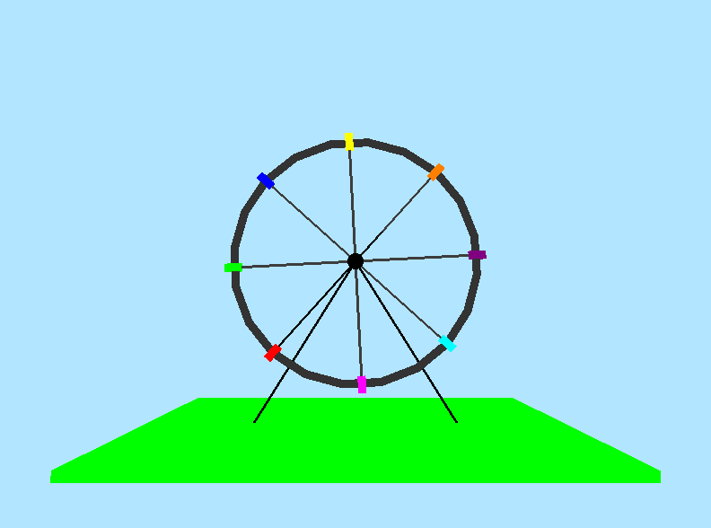

# 🎡 Roda-Gigante 3D em OpenGL

## Descrição
Este projeto implementa uma simulação de uma roda-gigante 3D utilizando a biblioteca OpenGL com GLUT. A roda-gigante gira continuamente e possui cadeirinhas coloridas, permitindo interação do usuário para alterar a velocidade de rotação e movimentar a câmera. Este trbalho foi desenvolvido como um projeto de computação gráfica utilizando OpenGL e GLUT.



## Funcionalidades
- Renderização de uma roda-gigante tridimensional com cadeiras coloridas.
- Iluminação básica para realismo.
- Controle da câmera utilizando o teclado e o mouse.
- Ajuste da velocidade de rotação da roda-gigante.
- Pausa e retomada da animação.

## Dependências
Para compilar e executar o projeto, é necessário ter instaladas as seguintes bibliotecas:
- OpenGL
- GLUT
- GLU

## Compilação e Execução
No Linux, utilize o seguinte comando para compilar o programa:

```bash
 g++ -o roda_gigante roda_gigante.cpp -lGL -lGLU -lglut -lm
```

Para executar:

```bash
./roda_gigante
```

## Controles
- `W`: Aproxima a câmera
- `S`: Afasta a câmera
- `Espaço`: Pausa/retoma a animação
- `X`: Aumenta a velocidade de rotação
- `Z`: Diminui a velocidade de rotação
- `ESC`: Sai do programa
- Movimentos do mouse: Rotaciona a câmera

## Estrutura do Código
- `setupLighting()`: Configura a iluminação da cena.
- `drawSphere()`: Desenha uma esfera.
- `drawSeat()`: Desenha uma cadeira com a cor especificada.
- `drawFerrisWheel()`: Renderiza a roda-gigante e suas cadeiras.
- `drawGround()`: Renderiza o chão.
- `display()`: Atualiza a tela com os elementos da cena.
- `update()`: Atualiza a animação da roda-gigante.
- `reshape()`: Ajusta a tela ao redimensionar a janela.
- `keyboard()`: Controla as entradas do teclado.
- `mouseMotion()`: Permite movimentação da câmera com o mouse.
